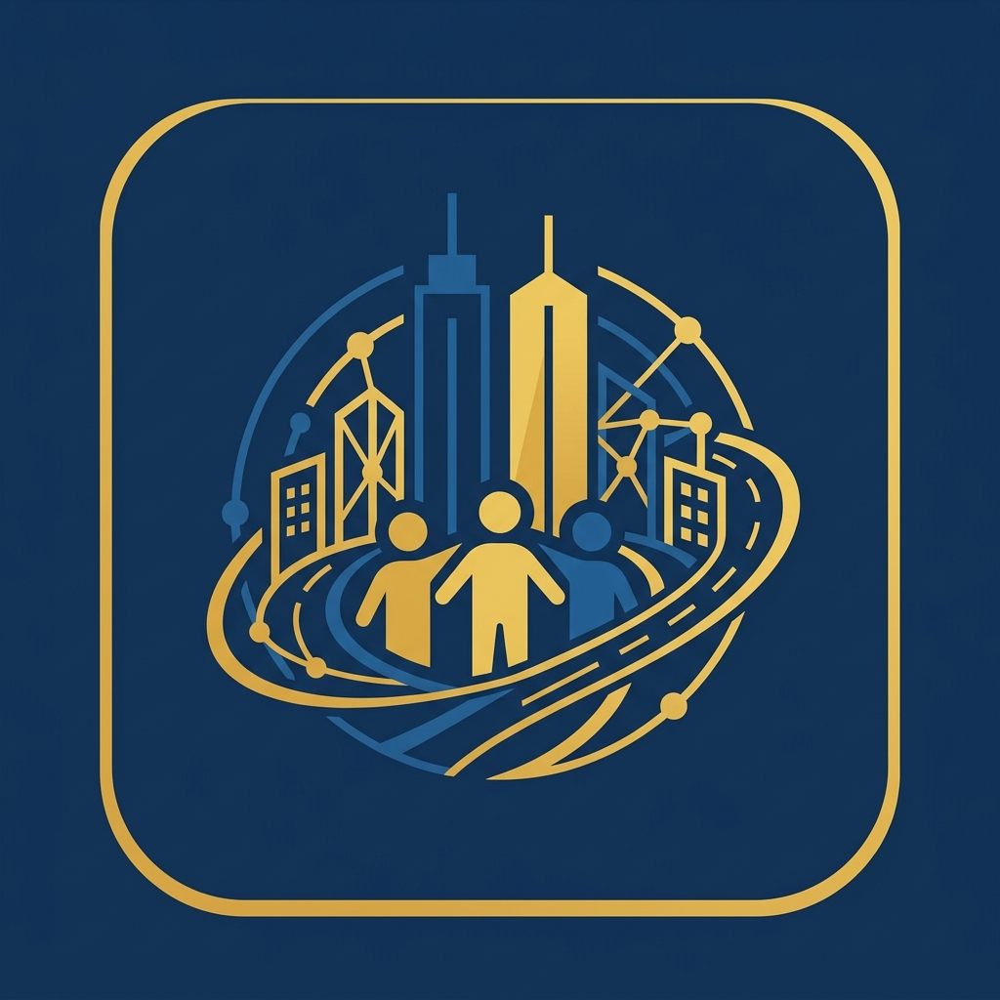
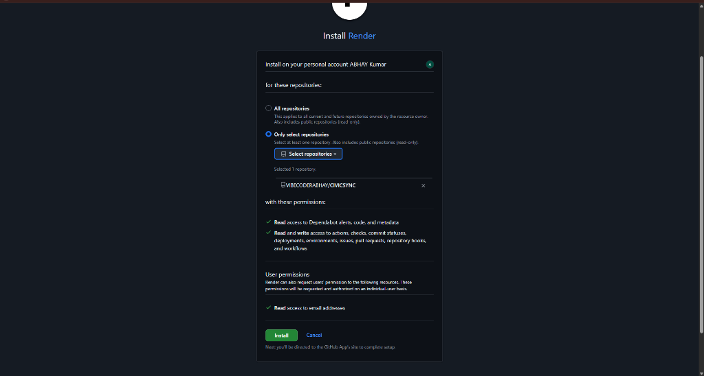

  
  
  # CivicSync: Empowering Citizens, Transforming Cities
  ### Official Project Description & Architecture Document

---

## PART 1: The Citizen Perspective (Public Engagement & Utility)

CivicSync is built with a primary goal: to bridge the gap between ordinary citizens and municipal authorities (Nagar Nigam). We provide a unified, highly accessible mobile and web application that empowers individuals to take charge of their local environment and civic duties.

### 1.1 The Core Problem for Citizens
Historically, filing a civic complaint (e.g., reporting a massive pothole, broken streetlights, or uncollected garbage) has been a tedious, bureaucratic nightmare. Citizens often have to visit physical offices, stand in queues, or use outdated, slow, and unresponsive government portals. Once a complaint is filed, it falls into a black hole with zero transparency or status updates, leading to immense public frustration and apathy toward civic maintenance.

### 1.2 The CivicSync Solution
We have revolutionized this process by giving citizens a "One-Tap" smart resolution platform. CivicSync's Citizen Module provides an intuitive, gamified, and transparent experience.

**Key Features for the Public:**
- **Smart AI Reporting:** A citizen simply clicks a photo of the issue (e.g., a broken streetlight). CivicSync's AI automatically analyzes the image, categorizes the issue (Electrical, Civil, Sanitation), tags the exact GPS coordinates, and assigns an urgency priority. No long forms to fill out.
- **Real-Time Live Tracking:** Just like tracking a food delivery or a cab, citizens can see exactly what stage their complaint is at ("Pending", "Assigned to Field Team", "In Progress", or "Resolved").
- **Interactive Heatmaps:** A beautiful, responsive Map Interface allows citizens to view all active issues in their neighborhood. This prevents duplicate reporting and builds a sense of community awareness.

### 1.3 Gamification and The "Civic Score"
To encourage active participation rather than just complaining, CivicSync introduces a gamified engagement model. 
- **Civic Score System:** Every verified report filed by a citizen earns them "Civic Points". 
- **Ranks and Badges:** Based on their points, citizens are upgraded from *Bronze Citizen* to *Silver Citizen* and *Gold Citizen*. 
- **Community Recognition:** Top contributors in a ward or sector are highlighted on the city's public leaderboard. This psychological reward system transforms complaining from a chore into a proud civic duty, building a proactive community.

### 1.4 DigiLocker KYC Integration
To prevent spam, fake reports, and political trolling, CivicSync integrates with the Government of India's DigiLocker APIs. Citizens can securely link their Aadhaar to become a "KYC Verified" reporter. Verified reporters bypass initial manual spam checks, ensuring their urgent issues go straight to the top of the Nagar Nigam's queue.

   

---

## PART 2: The Nagar Nigam Perspective (Command & Control)

While the citizen app focuses on ease of use, the Nagar Nigam (Authority) portal is a heavy-duty, data-driven Command Center designed to drastically improve the efficiency of municipal operations. 

### 2.1 The Core Problem for Authorities
Municipal bodies are constantly overwhelmed by a high volume of unstructured complaints. Without a smart filtering system, a minor issue (like a broken park bench) might get attended to before a critical emergency (like an open manhole on a busy highway). Furthermore, tracking the efficiency of ground workers and contractors is nearly impossible, leading to corruption and resource wastage.

### 2.2 The Smart Command Center
The CivicSync Official Portal is a role-based, highly secure web and mobile dashboard exclusively for government personnel. 

**Key Features for Authorities:**
- **AI-Powered Priority Triage (SLA Management):** When hundreds of complaints pour in, CivicSync's backend AI Engine automatically sorts them. An open sewer pipe is immediately flagged with a "CRITICAL" tag and an automated 12-hour SLA (Service Level Agreement), whereas a faded road sign is tagged "LOW" with a 7-day SLA. 
- **Automated Work-Order Generation:** Officials don't need to manually type out documents. With one click of the "Assign" button, CivicSync generates a digital work order and pushes it directly to the designated contractor's mobile device or field team.
- **Inventory & Dispatch Controls:** Directly from their Profile Dashboard, Nagar Nigam officials can access buttons to Dispatch Field Teams, Check Inventory (e.g., checking if spare LED streetlights are in stock before assigning a task), and manage logistics.

### 2.3 Analytics, Heatmaps & Predictive Maintenance
CivicSync turns reactive government into proactive government. 
- **Incident Heatmaps:** The Official Map view shows dense clusters of reports. If a specific intersection has 50 reports of potholes in one month, the dashboard flags it as a "Structural Anomaly", prompting a full road reconstruction rather than just patching it.
- **Contractor Accountability:** The system tracks how long it takes for assigned tasks to be marked as "Resolved" by contractors. If a specific contractor consistently violates SLAs, the system generates a warning report for the municipal commissioner.
- **Resource Allocation:** By analyzing historical data, the AI can predict which zones will require the most sanitation workers during monsoon season, allowing the city to pre-allocate funds and manpower.

### 2.4 Secure Architecture & Data Integrity
The entire official module is protected by strict Authentication and Role-Based Access Control (RBAC). A field worker sees only their assigned tasks, a Ward Officer sees tasks in their zone, and the Municipal Commissioner has a macro-level bird's-eye view of the entire city's operational health. 

By unifying citizens and officials on a single, transparent, AI-driven platform, **CivicSync doesn't just fix potholes—it rebuilds trust in the government.**
